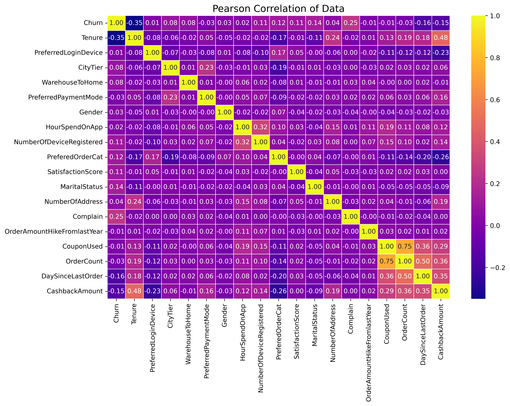

# Data Analysis and Churn Prediction on E-Commerce Data

Dataset is taken from Kaggle datasets: [Ecommerce Customer Churn Analysis and Prediction](https://www.kaggle.com/datasets/ankitverma2010/ecommerce-customer-churn-analysis-and-prediction?resource=download)      

## Pearson Correlation of the Dataset

&nbsp; Some insights on how churn is correlated with other variables:
* &nbsp; Churn is positively correlated with Complain.
* &nbsp; Churn is negatively correlated with Tenure, DaySinceLastOrder, and CashbackAmount.
* &nbsp; For the customers who have a Complain, PreferedOrderCat (Preferred order category of customer in last month) has a relatively high correlation with Churn. There might be a particular problem with a category. Customers complain about their orders in the Laptop & Accessory, Mobile, and Mobile Phone categories more than the other categories. Based ın the customer counts
